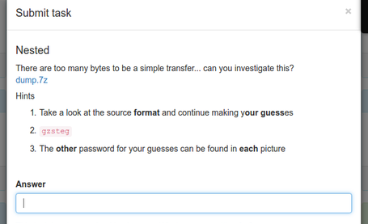

<h2> Nested </h2>
So, this was the forensics challenge in the Volga CTF 2017.

Here is the problem description.

I downloaded the 7z file(dump.7z)

Uncompressed it using the command

`7za e dump.7z`

It gave me a pcap file(dump.pcap). There were a lot of packets with USB in that capture file. I wasted some time reading up about USB protocol but to no avail.

The next thing I tried was to look for any useful strings in the pcap. So, I tried this command.

`strings dump.pcap | less`
 Found a lot of python code in there. Spent some time trying to make meaning out of it. Hit a dead end again.

Looked at the problem again. Since the problem name was nested and by the time the first hint had come out. I guessed that there could be another 7z file dumped in the pcap. 
The signature for the 7z file type is 37 7A BC AF 27 1C
Searching for this term in the hexdump proved my guess right.
I used the BLESS hexeditor for this.
At hex offset, 0x4dd26e, there appears to be a dump of a 7z file. 
Extract the file from the pcap. This is simple in BLESS. Just copy and paste the contents into a new file from that offset. I named the file as nested.7z

Now, run the command,
`7za e nested.7z`

This gives me two files: each.jpg and other.zip. 
Now, I tried to unzip the other.zip. It asks me for a password. How do we proceed now?

A part of the first hint "continue making y **our guess** es " suggests us that outguess may be a good tool at this point.

To get the secret message that is encrypted within the image(that may give us the password required to open other.zip), we can make use of this command
` outguess -k "passkey" -r each.jpg secret.txt`

How do we get the passkey though?
The 3rd hint( The **other** password for your guesses can be found in each picture. A nice way to phrase it! ) gives it away.

So , the command becomes:
`outguess -k "other" -r each.jpg secret.txt`

Running this command gives you the password:

`enj0y_Ur_z1ppy_c0mplex_phra$e!`

Use this password to open other.zip which further gives you a file called hide

I ran the following command now:
`file hide`
It shows:
`hide: gzip compressed data, from Unix, last modified: Fri Mar 17 16:53:24 2017`

How do you proceed from here?
Remember another hint is remaining, the 2nd one which says gzsteg.

We have a gz file and now it is obvious that something is hidden in the .gz file which can be got through the utility gzsteg.

Download the utility gzsteg
The README says that after applying the patches present, you can make use of a new options -s which helps hide/show the info in gz files.

It also says "At the time of writing this is version 1.2.4. The patches are context diffs so you stand a good chance of them working on versions other than 1.2.4"

To be sure, I downloaded the version 1.2.4 and ran the following commands:
`./configure`
`make`
This creates a gzip binary in the current folder.
Apply the patches.
`patch -c < patch1`
`patch -c < patch2`
`patch -c < patch3` 

Now run,
`./gunzip -s flag.txt hide`
This gives an error saying: 
gunzip: ../hide: unknown suffix -- ignored 
Do this:
`mv hide hide.hz`
and run the same command again.

`cat flag.txt` will give you:
**VolgaCTF{1t_wa$_s0_embedeasy!}**

Hurray!!! 

